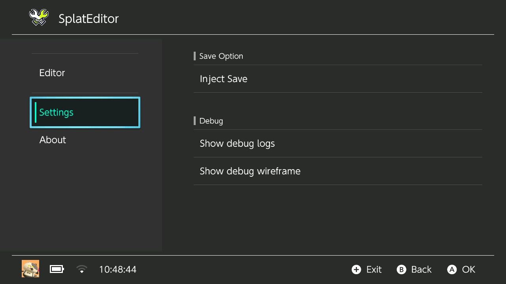

# SplatEditorNX

Open source Splatoon 2 save editor for the Nintendo Switch (NX) built on top of the [effective-spoon](https://github.com/3096/effective-spoon) project


## Informations

[](https://www.gnu.org/licenses/gpl-3.0.en.html)

- This app is free and open source, licensed under the GPLV3 license 


## Pics
 
<details>
  <summary>Show</summary>
  <p float="left">
  
  
  
  
  </p>
</details>


## Compiling

To properly compile this file you'll need [Python](https://python.org) (if you care about the scripts), the [devkitpro toolchain](https://github.com/devkitpro/pacman) and [libnx](https://github.com/switchbrew/libnx)

- Python libs:

```
pip install -r scripts/requirements.txt
```

- Install necessary libraries for borealis:

```
(sudo) (dkp-)pacman -S switch-glfw switch-mesa switch-glm
```

- Download app icon

```
python3 scripts/dl_icon.py
```

- Finally run to build the homebrew:

```
make -j8
```


## Installation

[!!KEEP IN MIND THAT EDITING THE SAVE CAN LEAD YOU INTO A BAN, SO IT'S HEAVILY SUGGESTED TO NOT USE IT IF YOU'RE NOT BANNED!!]

1. Download the latest release from the [releases](https://github.com/CrustySean/SplatEditorNX/releases) page

2. Put the homebrew into "sdmc:/"


## Usage

3. Open a game and keep pressing the "R" button until hbmenu shows up (running the app trough hbmenu won't work!)

4. Launch SplatEditorNX (this may take some seconds as it has to download some images)

5. Pick the Splatoon 2 version you have installed

6. Edit whatever you like

7. Press "Y" to save the changes

8. In Settings tab you'll need to click "Inject Save" button and wait for it to be injected

9. Launch Splatoon 2

10. Enjoy!


## Editing

if you need any internal id, just take a look at the [docs](https://github.com/CrustySean/SplatEditorNX/blob/master/docs)

[!!WARNING SAVING THE MODIFIED FILE WITH AN INCORRECT VALUE MAY RESULT INTO A WHOLE RESET OF YOUR SAVE!!]


## Credits

(if you need any help, please either join in my discord server or report an issue trough GitHub)

<a href="https://discord.gg/2gjrSsP">
  
</a>


I'd like to thanks these awesome people for the help they provided during the development:

- [3096](https://github.com/3096) for their epic [effective-spoon](https://github.com/3096/effective-spoon) project

- [Khangaroo](https://github.com/Khang06) for their useful fork of [effective-spoon](https://github.com/Khang06/effective-spoon)

- [Natinusala](https://github.com/natinusala) for their awesome [borealis](https://github.com/natinusala/borealis) library, suggestions & help (thanks a lot really^^)

- [Shadów](https://github.com/shadowninja108) for their help during the development / suggestions & help (thanks a lot really^^)

- [Xitrix](https://github.com/xitrix) for their wonderful contribution to [borealis](https://github.com/natinusala/borealis) and for their [Moonlight-Switch](https://github.com/XITRIX/Moonlight-Switch) project, some UI code come from there

- [Nlohmann](https://github.com/nlohmann) for their pretty [JSON library](https://github.com/nlohmann/json)

- [Nacho](https://github.com/nacho95101) for their pretty docs

- [Flagbrew](https://github.com/Flagbrew) for some code from the [Checkpoint](https://github.com/Flagbrew/Checkpoint) project used into the accountmgr code

- [Random06457](https://github.com/Random06457) for some code from their [NX-Title-Control-Dumper](https://github.com/Random06457/NX-Title-Control-Dumper) project which is used for extracting icons

- [WerWolv](https://github.com/WerWolv) for their pretty exception handler code, taken from the [EdiZon](https://github.com/WerWolv/EdiZon-Rewrite) project
